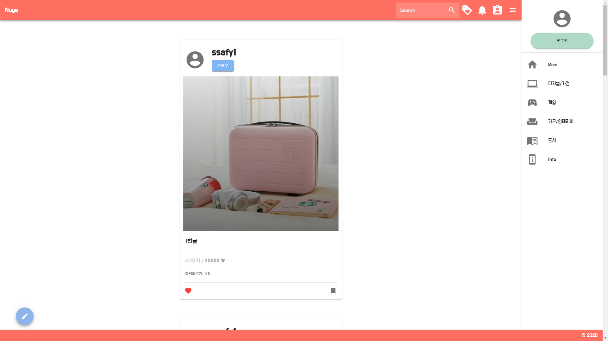
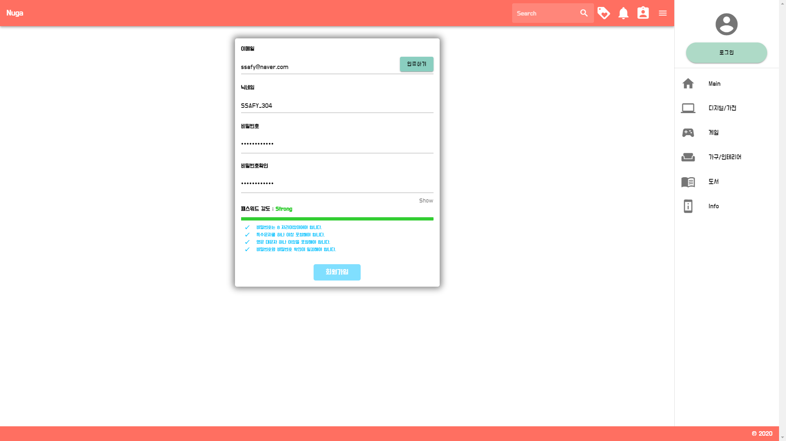
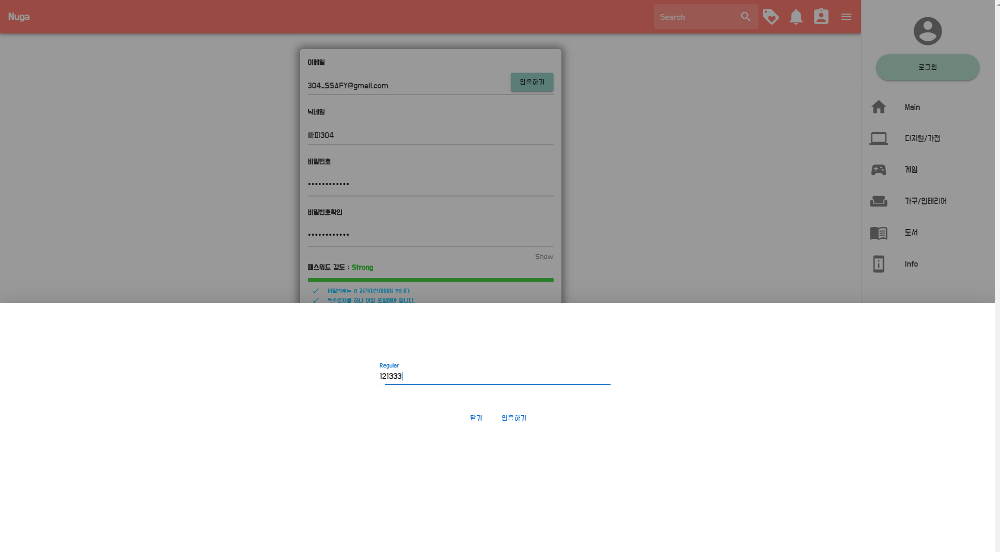
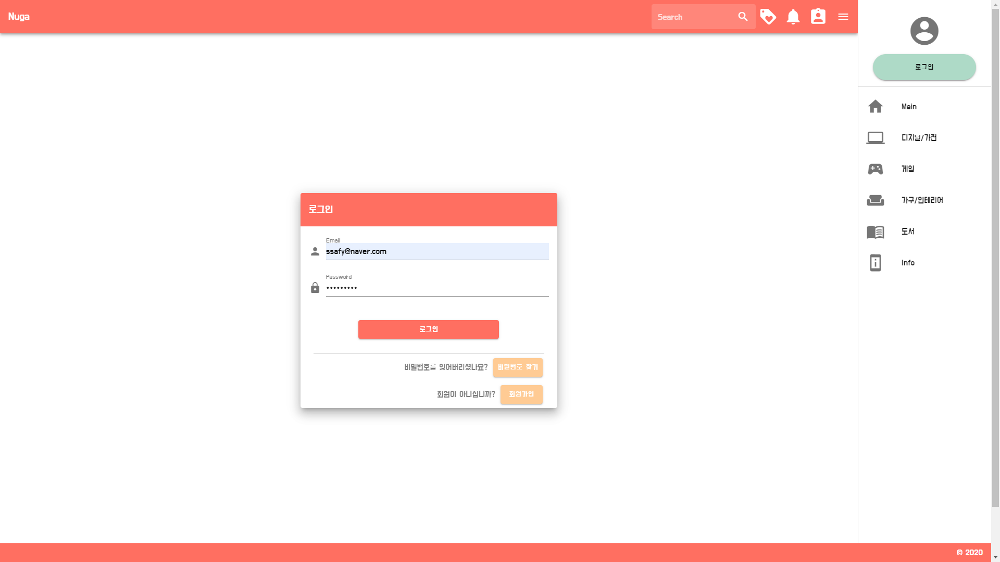
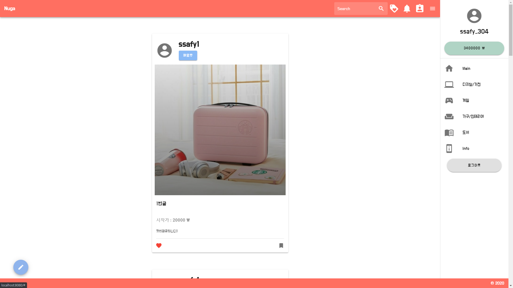
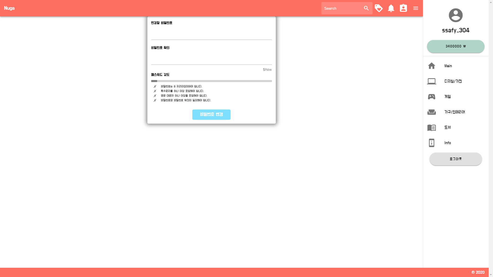
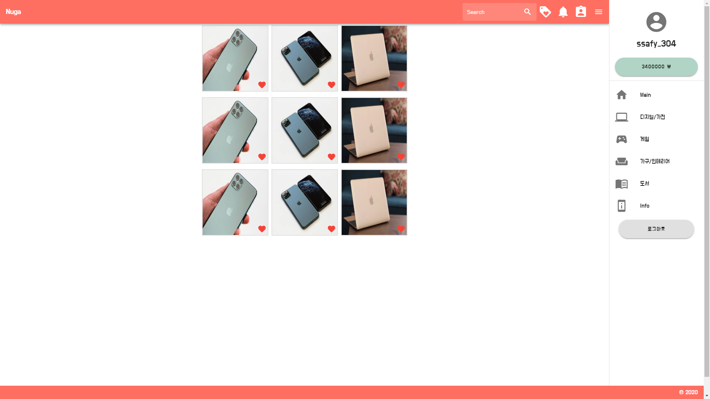
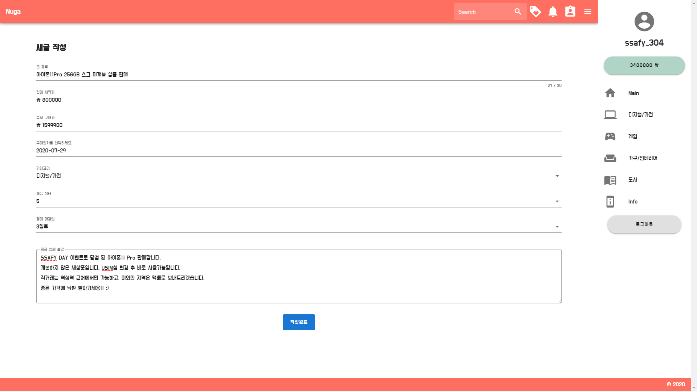
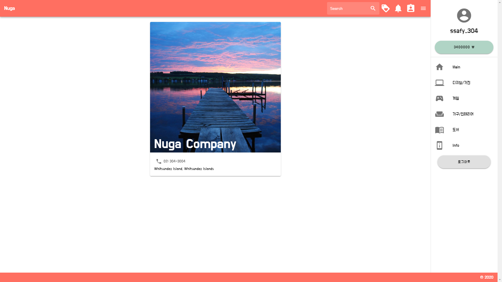

# NUGA README

## 1. 프로젝트 소개

### :name_badge: 프로젝트 이름 : NUGA


### :couple: 팀원소개

> 팀명 : NUGA
>
> 팀원: 한도현 (Backend developer)
>
> ​         김민재 (Frontend developer)
>
> ​         맹승규 (Frontend developer)
>
> ​         신현우 (Frontend developer)
>
> ​         강상우 (Backend developer)


### :musical_note: 프로젝트 소개

#### `에누리 없는 합리적 가격의 중고거래! ` `무책임한 거래 취소 없는 중고거래! `

- ##### NUGA는 거래욕구를 떨어트리는 허위 구매자가 없습니다.

- ##### NUGA는 경매 시스템을 통해 합리적으로 시장가격이 결정 됩니다.

- ##### NUGA는 본인인증이 확실한 사용자만 거래할 수 있습니다.


### :computer: 사용 언어 : Java, JavaScript, HTML, CSS


### :bulb: 기술 스택

- ##### Platform : Web/Mobile

- ##### Framwork : Vue.js, Spring boot

- ##### Database : MariaDB

- ##### Server : AWS

- ##### IDE : Visual Studio Code, IntelliJ IDEA


## 2. 프로젝트 사용법 

### :floppy_disk: Install

##### Using npm

```bash
npm install
```


### :woman_technologist:Usage

##### Import

```javascript
import Vue from 'vue'
import Vuex from 'vuex'
import cookies from 'vue-cookies'
```


### :gear:개발환경 설정

##### Frontend

```bash
cd frontend
npm install
npm install --save vue-cookies
npm run serve
```


##### Backend

```bash
cd backend
Lombock 플러그인 설치
 이클립스  : pom.xml에 추가
 인텔리제이 : plugins에서 install후 재실행
webCurationApplication.java 파일 실행
```


### :earth_americas: Browser Support

Chrome 사용을 권장합니다.


## 3. 서비스 설명

### :page_facing_up: 페이지/기능 소개

#### 1. 메인 페이지

- color tone : 리빙 코랄(Living Coral)
  - HEX 코드 : \#FF6F61
  - RGB : (255, 111, 97)
- Vuertify의 v-card를 이용하여, 인기순으로 상품들이 카드형식으로 정렬되어 있다. 
- 회원과 비회원을 분기하여 My Page 메뉴를 다르게 안내한다.




#### 2. 회원가입 페이지

- ID는 현재 이용중인 이메일을 입력받는다.
  - 이메일 인증 절차를 통해 사용자가 본인임을 인증받는다.
  - 인증번호는 숫자만, 최대 6자까지 입력 가능하다.
- 비밀번호는 강도에 따라 4단계로 구분되며 기준은 다음과 같다.
  - 비빌번호는 8자리 이상이여 한다.
  - 특수문자를 하나 이상 포함해야 한다.
  - 영문 대문자를 하나 이상 포함해야 한다.






#### 3. 로그인 페이지

- 로그인 성공 시 환영 메세지가 팝업 된다.
- 로그인 시 My Page에 회원 정보가 반영 되며 보유 마일리지가 표시 된다.






#### 4. 비밀번호 변경 페이지

- 회원가입 시 적용된 동일한 기준으로 비밀번호를 재설정 할 수 있다.




#### 5. 위시리스트 페이지

- 사용자는 찜하기 기능으로 현재 거래 중인 상품들 중 관심 상품을 설정할 수 있다.
  - 썸네일 이미지 우측 하단에 하트를 클릭하여 찜하기 기능을 사용할 수 있다.
  - 활성화 된 하트를 다시 클릭하면 하트가 비활성화 되며, 관심상품에서 제외 할 수 있다.




#### 6. 새글 작성 페이지

- 사용자는 새글 작성을 통해 판매 물품을 등록할 수 있다.
  - 경매 시작가격과 즉시 구매가격을 설정할 수 있다.
  - 구매 일자와 경매 마감 일자를 설정할 수 있다.
  - 제품 상태를 1~5단계로 세분화 하여 판매하는 제품의 상태를 나타낼 수 있다.
  - 기타 제품에 대한 상태, 거래 방식, 거래 조건 등에 대해 상세 설명을 통해 부연할 수 있다.




#### 7. 컨택트 작성 페이지

- 개발 및 운영에 관해서 언제든 문의주세용! :slightly_smiling_face: 




## 4. Contributing

### :call_me_hand: 개발 규칙

#### 1. Commit message

- 영어만을 이용해 작성, 총 70자를 넘기지 않는다
- 첫 글자는 반드시 대문자로 작성할 것,(고유명사를 제외한 나머지는 다 소문자로!!)
- 명령문 형식으로
- JIRA코드 번호는 `커밋 메세지` + `,(띄어쓰기)` + `코드번호`
- 띄어쓰기 잘하기!!!!!

```bash
// example
$ Edit login function, SP0S03P12A304-12
$ Modify backend server code, S03P12A304-13
$ Create user profile page, S03P12A304-20

// 고유명사
$ Modify SNS login function, S03P12A304-23
```


#### 2. Front

- VS code 사용시

  - Indenting space 👉 2

  

- 축약형 사용

  - `v-on` 👉 `@`
  - `v-bind` 👉 `:`

  

- 함수

  - 화살표함수

```javascript
login(){
    axios.post(BACKEND_URL)
    	.then(res => {
        console.log(res)
    	})
    	.catch(err => {
        console.log(err.response.data)
    })

}
```


- 뷰 컴포넌트명

  - 합성어로!! 각 단어의 첫 글자는 반드시 대문자

    ```
    // 좋음
    TodoItem
    MovieList
    MovieListItem
    
    // 나쁨
    todo
    Todo
    movielist
    Movielist
    ```


- `route name` == `component name`

  - 경로 관련해서 쓸때는 route name으로만 사용하기!!(경로 하드코딩❌)

    ```html
    <!-- 좋음 -->
    <router-link v-if="!isLoggedIn" :to="{ name: 'Login' }">Login</router-link>
    <!-- script 에서도! -->
    router.push({name:'Home'})
    
    
    <!-- 나쁨 -->
    <router-link v-if="!isLoggedIn" to="/account/user/login">Login</router-link>
    <!-- script 에서도! -->
    router.push('/account/user/login')
    
    ```


- 컴포넌트에서 사용할 함수나 변수명

  - **`lowerCamelCase`**

  - 맨 앞글자를 소문자로 나머지 뒤에 따라붙는 단어들의 앞글자는 모두 대문자로 표기

    ```
    // 예시
    fetchArticles
    createArticle
    postAuthData
    ```


- ⚠️ **단,**  `Mutations.js` 에서는 주의!!! ⚠️

  - **`ALL_CAPITAL_SNAKE_CASE`**

  - 모든 글자는 대문자로, 각 단어의 사이를 언더바`_`로 구분해주는 표기

    ```
    SET_TOKEN
    LOGIN
    SIGN_UP
    FIND_PW
    ```


- 추가적으로 축약이 필요한 단어의 경우에는, 네이밍하기전에 상의하기!!!

  ```
  password 👉 pwd, pw
  button 👉 btn, button
  ```


- `template`에서 id, class, for 등....정의할 때

  - 일반적으로 소문자

  - 합성어의 경우, 소문자-소문자

    ```html
    <div id="find-pw">
    	<form class="find-pw-form">
            <label for="email"></label>
            <input id="email" />
    	</form>
    </div>
    ```


#### 3. BackEnd

 - JAVA 프로그래밍

```
 - 변수는 CamelCase를 기본으로 한다.

예) userEmail, userCellPhone ...

 - 패키지명은 소문자를 사용한다.

에) frontend, useremail 

 - ENUM이나 상수는 대문자로 네이밍하고 ( - )을 사용하지 않는다

예) NORMAL_STATUS ...

 - 함수명은 소문자로 시작하고 동사로 네이밍한다.

예) getUserId(), isNormar() ...

 - 클래스명은 명사로 작성하고 UpperCamelCase를 사용한다.

예) UserEmail, Address ...

 - 컬렉션은 복수형을 사용하거나 컬렉션을 명시해준다.

예) List ids, Map<User, Int> userToIdMap ...

 - JPA Repository에서는 findXXX형식의 네이밍 쿼리메소드를 사용하므로 개발자 정의 메소드는 getXXX를 정의해서 사용한다
```

 - Structure

```
 - MVC 패턴을 기본으로 한다. 
 
 - Controller는 로직을 처리하지 않고 어떤 Service의 어떤 함수를 호출할지 결정과 Exception처리만을 담당하도록한다.
 
 - 하나의 메소드와 클래스는 하나의 목적을 두게 만든다.
 
 예) 예) 로그인 기능을 위해 사용자 검증 목적인 userValid 함수를 따로 만든다.
 
 - RequestMapping보다는 GetMapping, PutMapping 등 명시적으로 알아보기 쉽게 만든다.
```

 - 그외

```
- 조건문에 부정 조건을 넣는 것을 피한다.

예) if(!status.isOK)  (X) ,   if(status.isOK) (O)

- entity 모델 그대로 request 파라미터, response 파라미터를 사용하지 않는다.

예) 예) 대신, SignUpReqeust를 만들어 사용한다.

- AutoWired 대신에 롬복의 RequiredArgsConstructor과 private final을 이용한다.
```


## 5. License


## 6. 기타

### :man_technologist: 브랜치전략

```bash
     master
       ▼
    developer
       ▼
  back | front
       ▼
feature/function
```


### :calendar: 개발 일정

| Sub PJT 1 (2020.07.13 - 2020.07.17) | Sub PJT 2 (2020.07.20 - 2020.07.31) | Sub PJT 3 (2020.08.03 - 2020.08.21) |
| :---------------------------------: | :---------------------------------: | :---------------------------------: |
|    모바일 웹 디자인 및 기본 구성    |         SNS 기본 기능 개발          |        웹 큐레이션 SNS 완성         |


### 프로젝트 아키텍처


### :bug: 알려진 버그


